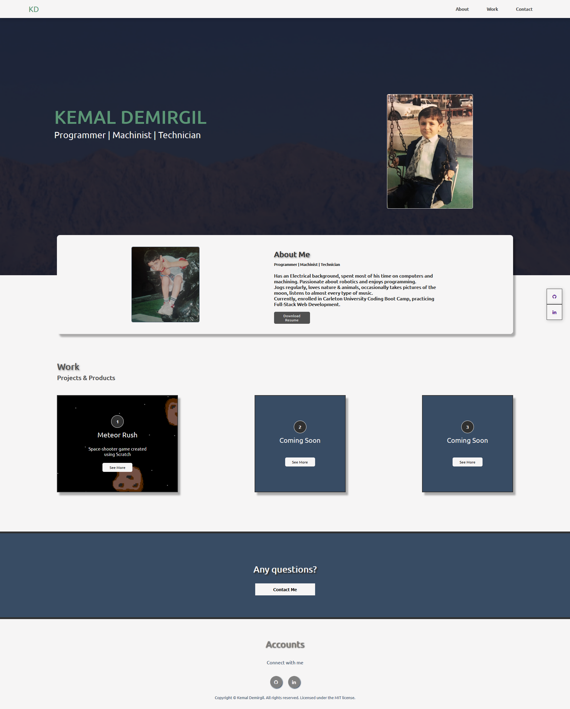

# Kemal Demirgil Portfolio

### Description:
This is my first attempt on making a fully functional portfolio website. During the process, I've only used `HTML` and `CSS` to build it and eventually in the future, I'm planning to build a more interactive portfolio using other technologies as well.

---
### Issues:
- The website isn't fully responsive to all screen sizes and devices, media queries needs adjustments.
- The website isn't fully accessible to every user.
---

### Improvements:
 >I need to fully be capable of controlling every elements position at all times. Discovering different usages of font styles will make a better display overall.

---
### Webpage:

---
### License:

Copyright © Kemal Demirgil. All rights reserved.
Licensed under the [MIT](https://github.com/kemaldemirgil/kd-portfolio/blob/main/LICENSE) license.
