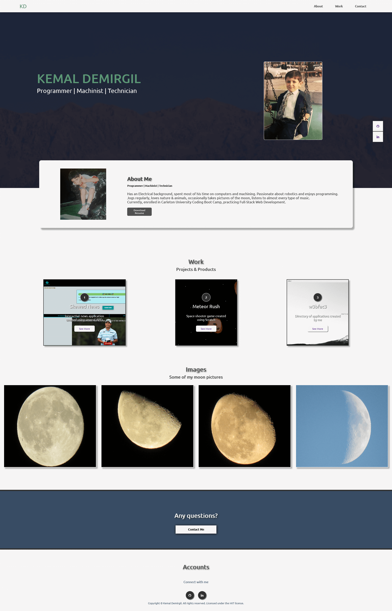

# Kemal Demirgil Portfolio

### Description:
This is my first attempt on making a fully functional portfolio website. During the process, I've only used `HTML` and `CSS` and I've also used this oppurtunity to experiment the **display** element. Eventually, in the future, I'm planning to build a more interactive portfolio using JavaScript and JQuerry for improved UI.

### Issues:
- Too much repetitive code, I could've done it using variables and better element targeting.

### Improvements:
 >Since this is an example portfolio, I wanted to use it for practicing and gaining some experience with CSS. Eventually, I want to be fully capable of controlling every elements position at all times and I think that discovering different usages of font styles could make a better display overall.

### Webpage:
link: https://kemaldemirgil.github.io/kd-portfolio/

### License:

Copyright © Kemal Demirgil. All rights reserved.
Licensed under the [MIT](https://github.com/kemaldemirgil/kd-portfolio/blob/main/LICENSE) license.
